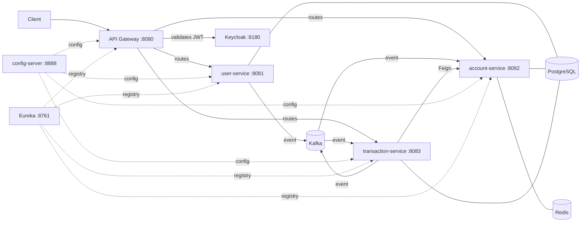
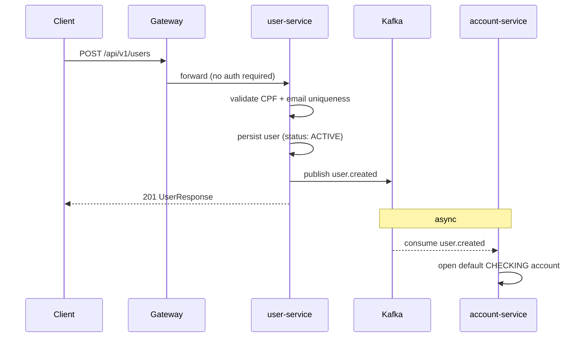
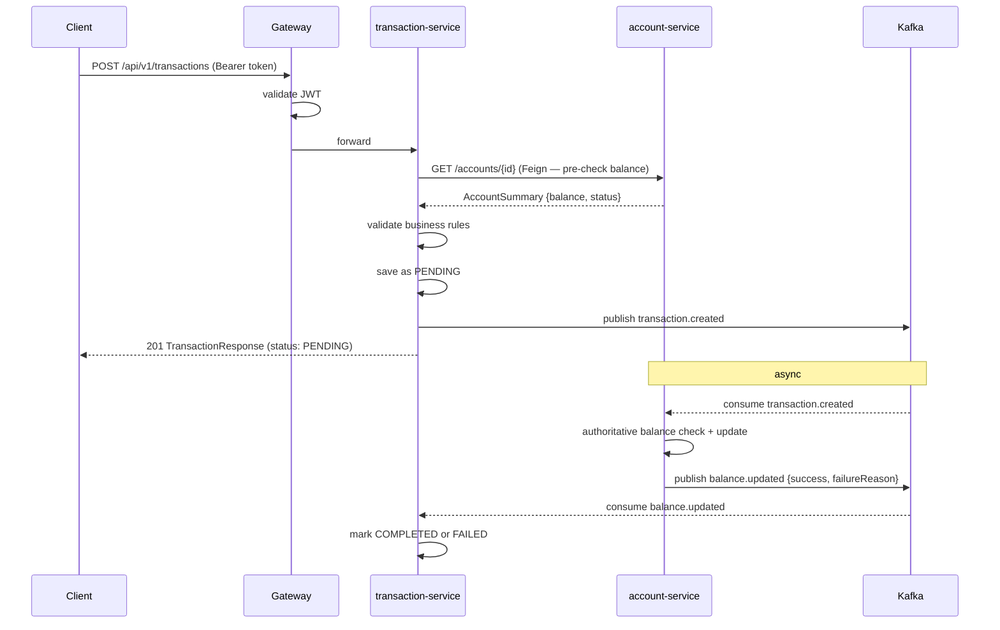

# Digital Bank Platform

A microservices-based digital banking backend built with Java 21 and Spring Boot 3. The project covers user management, bank accounts and financial transactions, secured with Keycloak and communicating asynchronously through Kafka.

Built as a portfolio project to practice microservices patterns in a realistic scenario.

---

## Architecture

```
┌──────────────────────────────────────────────────────────┐
│                      Docker network                       │
│                                                           │
│  ┌──────────┐    ┌───────────┐    ┌──────────────────┐  │
│  │  Client  │───▶│  Gateway  │───▶│  user-service    │  │
│  └──────────┘    │  :8080    │    │  account-service  │  │
│                  └─────┬─────┘    │  transaction-svc  │  │
│                        │ JWT      └────────┬─────────┘  │
│                        ▼                   │             │
│                  ┌──────────┐   ┌──────────▼──────────┐ │
│                  │ Keycloak │   │        Kafka         │ │
│                  │  :8180   │   │  (KRaft, no ZK)      │ │
│                  └──────────┘   └─────────────────────┘ │
│                                                           │
│  config-server :8888 · discovery-service :8761           │
│  PostgreSQL · Redis · Prometheus :9090 · Grafana :3000   │
└──────────────────────────────────────────────────────────┘
```



Each service owns its own database (`userdb`, `accountdb`, `transactiondb`). Schema migrations are handled by Flyway.

---

## Tech Stack

| | |
|---|---|
| **Language** | Java 21 |
| **Framework** | Spring Boot 3.3, Spring Cloud 2023 |
| **Security** | Spring Security, OAuth2 Resource Server, Keycloak 24 |
| **Persistence** | PostgreSQL 16, Spring Data JPA, Flyway |
| **Messaging** | Apache Kafka 3.7 (KRaft — no Zookeeper) |
| **Cache** | Redis 7 |
| **Service discovery** | Netflix Eureka |
| **Centralized config** | Spring Cloud Config Server |
| **API documentation** | SpringDoc OpenAPI 2 (Swagger UI) |
| **Observability** | Micrometer, Prometheus, Grafana |
| **Build** | Maven (multi-module) |
| **Containerization** | Docker, Docker Compose |

---

## Services

### `user-service`
Handles user registration and profile management. On registration, publishes a `user.created` event — account-service picks it up and automatically creates a default checking account.

### `account-service`
Manages bank accounts and balance changes. Consumes `transaction.created` events from Kafka, validates and applies balance changes, then publishes `balance.updated` with the result.

### `transaction-service`
Processes financial transactions (DEPOSIT, WITHDRAWAL, TRANSFER). Transactions are created as `PENDING` and updated to `COMPLETED` or `FAILED` asynchronously after account-service processes the balance change.

Communicates with account-service synchronously via Feign for a pre-validation check before persisting, and asynchronously via Kafka for the actual balance update.

### `api-gateway`
Single entry point for all external requests. Validates JWT tokens, adds a correlation ID header (`X-Correlation-ID`) to every request, and routes to the appropriate service via Eureka.

### `config-server`
Serves per-service YAML configuration centrally. Each service fetches its config on startup.

### `discovery-service`
Eureka server. Services register on startup; the gateway resolves service names to instances.

---

## Application Flows

### User registration



### Financial transaction



---

## Security

All services are OAuth2 Resource Servers — they validate JWTs issued by Keycloak.

The gateway validates the token first, so downstream services only receive pre-authenticated requests. Each service also validates independently (defense in depth).

**Roles** are extracted from the `realm_access.roles` claim in the JWT:

| Role | Access |
|------|--------|
| `ADMIN` | full access — list users, deactivate users, block accounts |
| `customer` | authenticated endpoints — own profile, own accounts, transactions |

Feign clients between services (e.g. transaction-service → account-service) forward the original `Authorization` header, so inter-service calls are also authenticated.

**Default Keycloak users (pre-configured in realm export):**

| User | Password | Role |
|------|----------|------|
| admin@digitalbank.com | admin123 | ADMIN |
| customer1@digitalbank.com | admin123 | customer |

---

## Kafka Topics

| Topic | Producer | Consumer | Purpose |
|-------|----------|----------|---------|
| `user.created` | user-service | account-service | Open default account after registration |
| `transaction.created` | transaction-service | account-service | Apply balance changes |
| `balance.updated` | account-service | transaction-service | Mark transaction as COMPLETED or FAILED |
| `transfer.completed` | transaction-service | — | Available for future notification consumers |

Consumers use `@RetryableTopic` with 3 attempts (2 s / 4 s backoff). On exhaustion, events land on a `.dlt` topic.

---

## Observability

Every service exposes a `/actuator/prometheus` endpoint. Prometheus scrapes all of them; Grafana has a pre-provisioned dashboard.

Metrics tracked per service: HTTP request rate, latency percentiles, JVM memory, active DB connections, Kafka consumer lag.

Access Grafana at `http://localhost:3000` (admin / admin123) — the dashboard is imported automatically on first boot.

---

## Running Locally

### Prerequisites

- Docker and Docker Compose
- Java 21
- Maven 3.9+

### 1. Environment variables

```bash
cp .env.example .env
# defaults work as-is — edit if you want different credentials
```

### 2. Build

```bash
mvn clean package -DskipTests
docker compose build
```

### 3. Start everything

```bash
docker compose up -d
```

Keycloak takes 60–90 seconds on first boot while it imports the realm. Wait for all containers:

```bash
docker compose ps
# all services should show "healthy"
```

### 4. Development mode (run services from IDE)

If you want to run the Java services from IntelliJ or VS Code and only need the infrastructure:

```bash
docker compose -f docker-compose.infra.yml up -d
```

Then run each Spring Boot application normally. They will register with Eureka and fetch config from the config-server automatically.

---

## Running Tests

```bash
# all modules
mvn test

# single service
mvn test -pl user-service
mvn test -pl account-service
mvn test -pl transaction-service
```

Tests use Mockito for unit tests and `@DataJpaTest` with H2 for repository tests. No Testcontainers — the test stack is kept lightweight intentionally.

---

## Endpoints

All requests go through the gateway at `http://localhost:8080`.

### Get a JWT

```bash
TOKEN=$(curl -s -X POST \
  http://localhost:8180/realms/digital-bank/protocol/openid-connect/token \
  -d "client_id=digital-bank-client" \
  -d "grant_type=password" \
  -d "username=admin@digitalbank.com" \
  -d "password=admin123" | jq -r .access_token)
```

### Users

```bash
# Register (public — no token needed)
curl -s -X POST http://localhost:8080/api/v1/users \
  -H "Content-Type: application/json" \
  -d '{
    "fullName": "Maria Souza",
    "email": "maria@email.com",
    "cpf": "529.982.247-25",
    "birthDate": "1990-06-15"
  }' | jq .

# List all users (ADMIN)
curl -s http://localhost:8080/api/v1/users \
  -H "Authorization: Bearer $TOKEN" | jq .

# Get user by ID
curl -s http://localhost:8080/api/v1/users/{id} \
  -H "Authorization: Bearer $TOKEN" | jq .

# Update user
curl -s -X PUT http://localhost:8080/api/v1/users/{id} \
  -H "Authorization: Bearer $TOKEN" \
  -H "Content-Type: application/json" \
  -d '{"fullName": "Maria Oliveira Souza"}' | jq .

# Deactivate user (ADMIN)
curl -s -X DELETE http://localhost:8080/api/v1/users/{id} \
  -H "Authorization: Bearer $TOKEN"
```

### Accounts

```bash
# Open an account
curl -s -X POST http://localhost:8080/api/v1/accounts \
  -H "Authorization: Bearer $TOKEN" \
  -H "Content-Type: application/json" \
  -d '{
    "userId": "{userId}",
    "type": "CHECKING",
    "branch": "0001"
  }' | jq .

# Get balance
curl -s http://localhost:8080/api/v1/accounts/{id}/balance \
  -H "Authorization: Bearer $TOKEN" | jq .

# List accounts by user
curl -s http://localhost:8080/api/v1/accounts/user/{userId} \
  -H "Authorization: Bearer $TOKEN" | jq .

# Block account (ADMIN)
curl -s -X PATCH http://localhost:8080/api/v1/accounts/{id}/block \
  -H "Authorization: Bearer $TOKEN"
```

### Transactions

```bash
# Deposit
curl -s -X POST http://localhost:8080/api/v1/transactions \
  -H "Authorization: Bearer $TOKEN" \
  -H "Content-Type: application/json" \
  -d '{
    "sourceAccountId": "{accountId}",
    "amount": 1000.00,
    "type": "DEPOSIT",
    "description": "Initial deposit"
  }' | jq .

# Withdrawal
curl -s -X POST http://localhost:8080/api/v1/transactions \
  -H "Authorization: Bearer $TOKEN" \
  -H "Content-Type: application/json" \
  -d '{
    "sourceAccountId": "{accountId}",
    "amount": 150.00,
    "type": "WITHDRAWAL"
  }' | jq .

# Transfer
curl -s -X POST http://localhost:8080/api/v1/transactions \
  -H "Authorization: Bearer $TOKEN" \
  -H "Content-Type: application/json" \
  -d '{
    "sourceAccountId": "{sourceAccountId}",
    "destinationAccountId": "{destAccountId}",
    "amount": 250.00,
    "type": "TRANSFER",
    "description": "Rent payment"
  }' | jq .

# Bank statement (with filters)
curl -s "http://localhost:8080/api/v1/transactions/account/{accountId}/statement?from=2025-01-01&to=2025-12-31&type=TRANSFER&page=0&size=10" \
  -H "Authorization: Bearer $TOKEN" | jq .
```

**Idempotency:** include `"idempotencyKey": "some-uuid"` in the transaction body to safely retry without double-processing.

---

## Service URLs

| | URL |
|---|---|
| API Gateway | http://localhost:8080 |
| Keycloak admin | http://localhost:8180/admin |
| Eureka dashboard | http://localhost:8761 |
| Swagger — user-service | http://localhost:8081/swagger-ui.html |
| Swagger — account-service | http://localhost:8082/swagger-ui.html |
| Swagger — transaction-service | http://localhost:8083/swagger-ui.html |
| Grafana | http://localhost:3000 |
| Prometheus | http://localhost:9090 |

---

## Possible Next Steps

Things that would make sense to add but aren't in scope for this project:

- **Integration tests** with Testcontainers (PostgreSQL + Kafka)
- **Notification service** — consume `transfer.completed` and send email/push
- **Transaction limits** — daily limit per account, configurable per account type
- **Audit log** — separate service or table tracking who changed what and when
- **CI/CD** — GitHub Actions pipeline building, testing and pushing images
- **Account closure** — with balance validation before closing
- **Refresh token** handling on the client side

---

## Project Structure

```
digital-bank-platform/
├── api-gateway/
├── config-server/
│   └── src/main/resources/config/     # per-service YAML
├── discovery-service/
├── user-service/
├── account-service/
├── transaction-service/
├── infra/
│   ├── keycloak/realm-export.json     # pre-configured realm + users
│   ├── postgres/init.sql              # creates databases on first boot
│   ├── prometheus/prometheus.yml
│   └── grafana/                       # provisioned dashboards
├── docker-compose.yml                 # full stack
├── docker-compose.infra.yml           # infra only (for IDE development)
├── .env.example
└── pom.xml                            # Maven multi-module root
```
